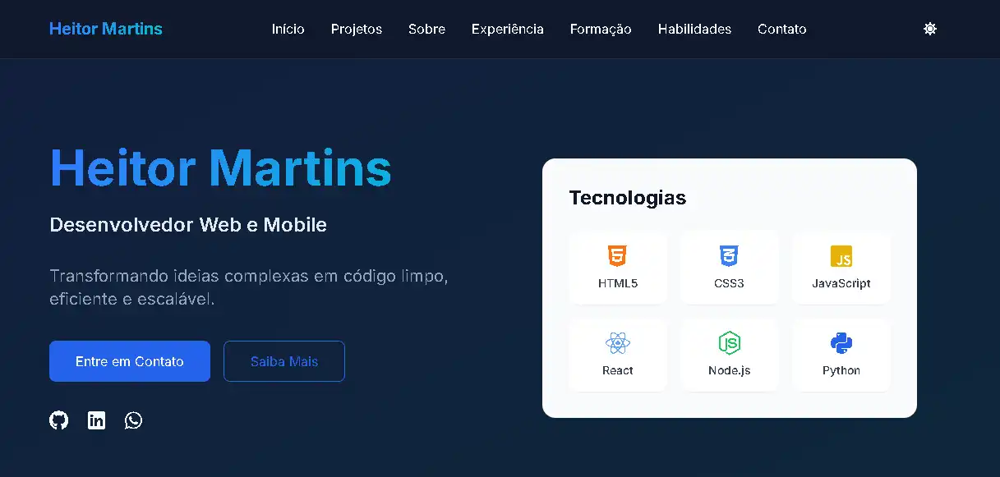

# 🚀 Heitor Martins | Modern Portfolio

Portfólio pessoal moderno desenvolvido com foco em alta performance, acessibilidade e design responsivo. O projeto foi estruturado utilizando o ecossistema React moderno e otimizado para atingir boas pontuações no Google Lighthouse, garantindo uma experiência de usuário fluida e carregamento instantâneo.

---

## 🛠️ Tecnologias e Ferramentas

### Frontend & Estilização
* **React 18** (Arquitetura baseada em componentes funcionais e hooks)
* **Vite** (Build tool ultrarrápido substituto do CRA)
* **TypeScript** (Tipagem estática para maior segurança e escalabilidade)
* **Tailwind CSS** (Estilização utilitária e design responsivo)
* **Shadcn/UI & Radix UI** (Componentes acessíveis e totalmente customizáveis)
* **Framer Motion** (Animações fluidas e interativas)

### Utilitários
* **Lucide React & FontAwesome** (Biblioteca de ícones modernos)
* **Wouter** (Roteamento leve e focado em performance para SPAs)
* **React Query (Tanstack Query)** (Gerenciamento de estado assíncrono)

---

## ⚡ Otimizações de Performance & Boas Práticas 

O grande diferencial deste projeto não está apenas na interface, mas na engenharia de software aplicada nos bastidores para mitigar gargalos comuns de Single Page Applications:

* **Code Splitting & Lazy Loading (React.lazy + Suspense):
* ** Em vez de forçar o navegador a baixar todo o código do site de uma vez só, o portfólio foi fragmentado em *chunks* dinâmicos. Seções pesadas como "Projetos" e "Experiência" só são carregadas sob demanda, derrubando o **FCP (First Contentful Paint)**.
* **Asset Optimization (Práticas de LCP):** Substituição de formatos antigos de imagem por **WebP** na imagem do Open Graph e assets principais, garantindo compressão sem perda de qualidade.
* **Tailwind Static Compiling Fix:** Eliminação de concatenações dinâmicas de strings na estilização que geravam quebras no Purge do Tailwind, resultando em um bundle CSS final limpo e enxuto.
* **Eliminação de Bloqueios de Renderização:** Ajuste estrutural e carregamento assíncrono e condicional de scripts externos (fontes e bibliotecas de ícones duplicadas).
* **Acessibilidade (a11y):** Inclusão de tags semânticas do HTML5, propriedades de `aria-label` em links de navegação e redes sociais, e controle rigoroso de contraste de cores no tema Dark.

---

## 📦 Estrutura do Projeto

A arquitetura do projeto segue as melhores convenções de mercado para aplicações React:


├── public/          # Assets estáticos de acesso direto (favicon, OG Images)
├── src/
│   ├── components/  # Componentes reutilizáveis
│   │   └── ui/      # Componentes primitivos e acessíveis (Shadcn/UI)
│   ├── hooks/       # Hooks customizados (Ex: controle de tema e responsividade)
│   ├── lib/         # Utilitários globais e configurações de bibliotecas
│   ├── pages/       # Páginas principais da aplicação (Home/NotFound)
│   ├── App.tsx      # Componente raiz
│   └── main.tsx     # Ponto de entrada do ecossistema React/Vite

---

## 🚀 Como Executar o Projeto Localmente

1. Clone o repositório:
   ```bash
   git clone [https://github.com/heitornm/HeitorModern.git](https://github.com/heitornm/HeitorModern.git)

## 📈 Análise de Performance & Infraestrutura (Lighthouse)

Durante as avaliações do **Google Lighthouse**, o projeto demonstrou excelentes métricas de carregamento estrutural, mas sofreu impactos de latência no ambiente mobile devido a limitações de infraestrutura de hospedagem gratuita (Render Free Tier):

| Métrica | Resultado (Mobile) | Status / Análise |
| :--- | :--- | :--- |
| **Speed Index** | `3.3s` | 🟢 **Excelente (91/100)**. Indica que a interface é montada e distribuída de forma extremamente ágil assim que os dados chegam. |
| **First Contentful Paint (FCP)** | `2.9s` | 🟡 **Intermediário**. Impactado pelo tempo de resposta inicial do servidor (*Cold Start*). |
| **Largest Contentful Paint (LCP)** | `5.3s` | 🔴 **Alvo de Latência de Rede**. Ocorre estritamente devido ao *spin-down* do plano gratuito do Render, que deixa a aplicação em modo de hibernar após inatividade. |

### 💡 Soluções de Engenharia Aplicadas para Mitigar o Gargalo de Infraestrutura:
1. **Módulos sob demanda (Code Splitting):** Para compensar o atraso do servidor gratuito, o bundle principal foi reduzido ao menor tamanho possível. Uma vez que o servidor responde, o navegador baixa e renderiza a tela em poucos milissegundos.
